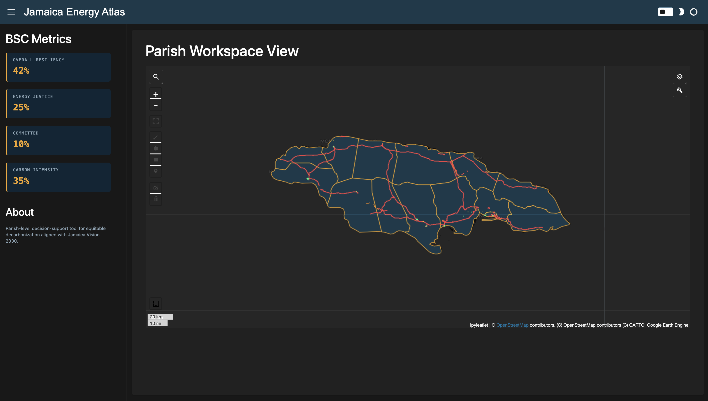

# Jamaica Energy Atlas

## Overview
The Jamaica Energy Atlas is a Parish-level decision-support tool for equitable decarbonization, built in Python using Panel and Google Earth Engine. The tool is designed for academic and policy audiences to visualize where Jamaica stands today in terms of energy access, infrastructure, and household energy burden — and how the island can realistically reach its Vision 2030 renewable energy targets.
The Atlas maps Jamaica's 14 parishes against key energy metrics including household expenditure, estimated energy burden, and grid infrastructure. Planned modules will add decarbonization scenario modeling, rooftop solar potential analysis via GeoAI, and a Balanced Scorecard vulnerability index aligned with the Medium Term Socio-Economic Policy Framework (MTF) 2024–2027.
This project is developed in connection with a UCL collaboration with Dr. Catalina Spataru (UCL Energy Institute).

[Full README to come as project develops]
