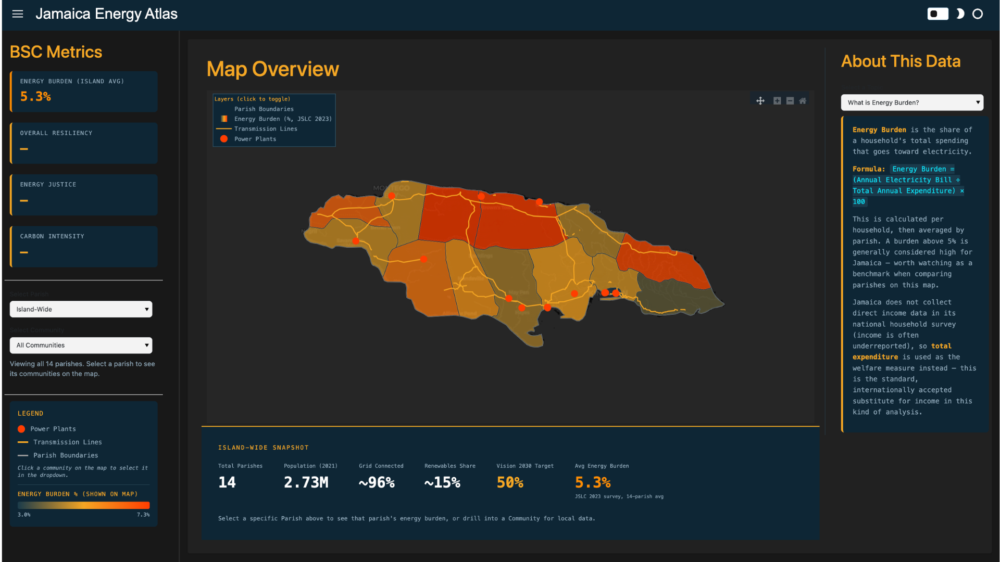
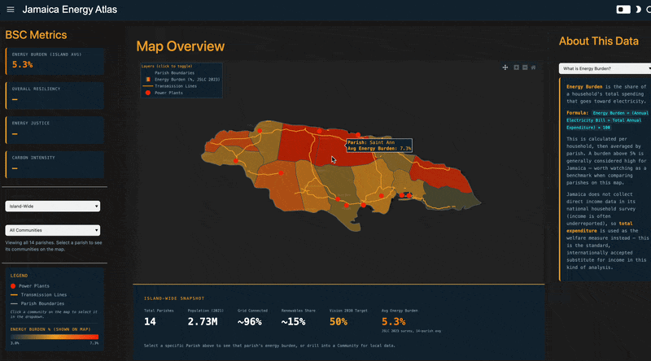

# Jamaica Energy Atlas


## Overview
Last updated: July 12 2026

The Jamaica Energy Atlas is a decision-support tool for equitable decarbonization, built in Python with Panel and Plotly. It provides parish- and community-level analysis of energy burden, poverty, and grid infrastructure across Jamaica, designed to show where the country stands today relative to its Vision 2030 renewable energy goals and where investment could be targeted most effectively.

Jamaica's Vision 2030 National Development Plan (published 2009) originally set a goal of 20% renewables by 2030; that target was increased in 2018 to 50%. Current renewable generation sits around 10–12%. This tool is built to help visualize the gap between where Jamaica is and where it needs to be — parish by parish, community by community — rather than only at the national level, by understanding where energy burdens and poverty are highest.

This is **Version 1** of the Atlas: parish-level energy burden (real JSLC 2023 survey data), community-level poverty rate and consumption (2012 small-area model), grid infrastructure mapping, and an interactive choropleth map with drill-down navigation. Later phases are planned to add decarbonization scenario modeling, rooftop solar potential analysis, and institutional/policy context layers — see the Outputs section for what's implemented now versus planned.

Built in collaboration with personnel at University College London's Island and Coastal Resilience Lab and inspired by tools including the Drawdown GA Emissions and Climate Solutions Trackers, Our World in Data's emissions trackers, the U.S. DOE's LEAD and SLOPE Tools, and PIOJ's own Vision 2030 monitoring dashboards.

## Demo / Example

*Screenshot placeholder — add a screenshot of the running app here.*

Run locally with `panel serve app.py --show` (see Setup & Usage below).

## Data Sources

| Name/Description | Originator/Provider | Access Link | Date Accessed | License/Restrictions |
|---|---|---|---|---|
| Jamaica Parish Boundaries (GeoJSON) | SimpleMaps | [simplemaps.com/gis/country/jm](https://simplemaps.com/gis/country/jm) | June 2026 | Free tier, see SimpleMaps terms |
| Incidence of Poverty, Jamaica (2012) — community-level poverty rate (`Per_Tot_Po`) | PIOJ / STATIN (ArcGIS small-area model) | ArcGIS web map, scraped via custom `grab_data.py` script into `jamaica_poverty_2012.geojson` | June 2026 | Public PIOJ data |
| Household Consumption per Equivalent Adult, Jamaica (2012) — community-level consumption (`av_CONS`) | PIOJ / STATIN (ArcGIS small-area model) | ArcGIS web map, scraped via custom `grab_data.py` script into `jamaica_consumption_2012.geojson` | June 2026 | Public PIOJ data |
| Jamaica Survey of Living Conditions (JSLC) Annual 2023 microdata — Annual Electricity Bill, Total Annual Expenditure, per-household | PIOJ (Statistical Institute of Jamaica survey) | Provided directly via email by Richard Leach, PIOJ | June 2026 | Research use; not redistributed in this repo |
| OSM Power Infrastructure (transmission lines, substations, power plants, generators) | OpenStreetMap contributors, via Overpass Turbo | [overpass-turbo.eu](https://overpass-turbo.eu) — two queries run June 8, 2026 and June 15, 2026 (second query expanded coverage to include `generator`, `relation` types) | June 8 & 15, 2026 | ODbL |
| Open Infrastructure Map — baseline cross-check of 21 named power plants | Open Infrastructure Map | [openinframap.org](https://openinframap.org/#7.47/18.109/-77.088) and [plant list](https://openinframap.org/stats/area/Jamaica/plants) | June 2026 | Public |
| GeoFabrik Jamaica OSM extract (roads, waterways, landuse, buildings, POIs, etc.) | GeoFabrik, via OpenStreetMap | [download.geofabrik.de/central-america/jamaica.html](https://download.geofabrik.de/central-america/jamaica.html) — downloaded as `.gpkg`, layers exported to GeoJSON via QGIS | June 2026 | ODbL |
| Population and Dwelling Counts by Community | Statistical Institute of Jamaica (STATIN), 2022 Population Census | [statinja.gov.jm/PopCensus/Census2022/Population and Dwelling counts by Community.aspx](https://statinja.gov.jm/PopCensus/Census2022/Population%20and%20Dwelling%20counts%20by%20Community.aspx) | June 2026 | Public STATIN data |

**Not yet integrated but downloaded for future use:** additional GeoFabrik layers (roads, waterways, water, landuse, places, transport, POIs, parking/gas, road infrastructure, houses of worship, buildings) — held as `assets/geofabrik/` for later Phase 2/3 work (e.g. rooftop solar siting).

## Data Processing and Methodology

### Software/Tools Used
- **Python 3.11**
- **Panel** — dashboard framework and app serving
- **Plotly** (`graph_objects`: `Choroplethmapbox`, `Scattermapbox`) — interactive map rendering
- **GeoPandas / Pandas** — vector data processing, tabular joins
- **pyreadstat** — reads SPSS `.sav` microdata (JSLC 2023) into Pandas
- **Overpass Turbo** — OSM infrastructure querying
- **QGIS** — GeoFabrik `.gpkg` layer export to GeoJSON

### Key Processing Steps

**CRS correction.** The 2012 poverty and consumption GeoJSON files reported their CRS as EPSG:4326 (standard lat/lon), but their actual coordinate values were in EPSG:3857 (Web Mercator meters) — a mislabeling from the original scrape. Both files are force-reassigned to EPSG:3857 and then properly reprojected to EPSG:4326 before use.

**Parish name normalization.** Parish names appear inconsistently across source files (e.g. "ST. THOMAS", "St.Elizabeth", "Saint Andrew"). A normalization function strips punctuation, standardizes casing, and converts "SAINT" to "ST" to produce a consistent join key used across every dataset.

**Energy burden calculation (parish-level).** Using JSLC 2023 Annual microdata (1,719 households): `energy_burden_pct = (Annual Electricity Bill ÷ Total Annual Expenditure) × 100`, calculated per household, then averaged by parish. This directly follows the U.S. DOE LEAD Tool's methodology, substituting total expenditure for income since JSLC does not collect direct household income data (income is commonly underreported in surveys; expenditure is the standard substitute welfare measure).

**Poverty rate and consumption (community-level).** Sourced from a 2012 PIOJ/STATIN small-area statistical model, which combines sparse JSLC survey responses with the complete 2011 Population Census to estimate values for individual communities — far more granular than JSLC's own household sample could support directly. These are modeled estimates, not direct measurements, and are labeled as such throughout the app.

**OSM infrastructure extraction.** Two Overpass Turbo queries were run (June 8 and June 15, 2026). The first query returned 3,832 elements (180 ways, 3,652 nodes) but used simple line/node tagging only. The second, more complete query added `generator` and `relation` types, expanding coverage to 2,065 features and correctly isolating exactly 21 true power plants (`power=plant`) — matching Open Infrastructure Map's independent count — plus 23 individual generators (solar, wind, hydro). For simplicity, the current app maps only transmission lines and power plants from this dataset, not distribution lines or generators individually.

**Power plant filtering.** OSM entries with no `name` tag (`name=nan`) are excluded from the map's power plant markers, since they render as unlabeled "ghost" pins with no useful information.

### Assumptions Made
- Total Annual Expenditure is used as the welfare proxy for energy burden calculations, since JSLC does not collect reliable household income data.
- 2012 small-area poverty/consumption estimates are treated as broadly indicative of current community-level conditions, despite their age — this is flagged explicitly in the app's "About This Data" panel rather than presented as current data.
- OSM-sourced infrastructure data is assumed reasonably representative of Jamaica's grid, though coverage may be incomplete in rural parishes given OSM's contributor-dependent nature.

## Project Structure

```
JA Energy Atlas/
├── app.py                                    # Main Panel application
├── assets/
│   ├── ja_parishes.json                      # Parish boundaries (SimpleMaps)
│   ├── jamaica_poverty_2012.geojson          # Community poverty rate (2012 model)
│   ├── jamaica_consumption_2012.geojson      # Community consumption (2012 model)
│   ├── overpass_energy_infra_2.geojson       # OSM power infrastructure (2nd query)
│   ├── PopulationandDwellingCountsbyCommunity_.csv   # STATIN community demographics
│   ├── jslc_2023_parish_burden.csv           # Derived: parish-level energy burden (from JSLC 2023 .sav)
│   ├── JSLC_Annual2023_ML.sav                # Raw JSLC 2023 microdata (source of truth, archived)
│   └── geofabrik/                            # Additional OSM layers, not yet integrated
└── README.md
```

## Setup & Usage

### Prerequisites
- Python 3.11+

### Installation

```bash
# Clone the repo
git clone https://github.com/marklann77/JA-Energy-Atlas.git
cd JA-Energy-Atlas

# Create and activate a virtual environment
python3 -m venv atlas_env
source atlas_env/bin/activate        # Mac/Linux
# .\atlas_env\Scripts\activate       # Windows

# Install dependencies
pip install panel geopandas pandas plotly pyreadstat
```

### Execution

```bash
panel serve app.py --show
```

The app opens at `http://localhost:5006/app`.

## Outputs

**Implemented in Version 1:**
- Interactive dark-themed map (Plotly `Choroplethmapbox`/`Scattermapbox`) with pan, zoom, and toggleable layers
- Parish-level choropleth colored by real energy burden % (JSLC 2023 survey data)
- Community-level choropleth colored by poverty rate (2012 small-area model), shown on drilling into a parish
- Grid infrastructure overlay: transmission lines and named power plants (OSM)
- Click-to-select: clicking a community on the map sets the sidebar dropdown
- Reactive sidebar with Balanced Scorecard-style energy burden metric, parish/community dropdowns, and a gradient legend matching whichever choropleth is active
- Reactive bottom bar with real statistics (island-wide, parish-level, or community-level depending on selection)
- Right-side "About This Data" panel with plain-language definitions of energy burden, poverty rate, data sources, and Vision 2030 context

**Planned for later phases:**
- Decarbonization scenario modeling (BAU / MTF 2027 / Vision 2030 Aggressive pathways)
- Rooftop solar potential analysis using GeoAI / satellite imagery
- Institutional and policy context layer (PIOJ, MSET, OUR stakeholder mapping)
- Integration of remaining GeoFabrik layers (buildings, roads, water) for infrastructure siting analysis

## License

**Code:** MIT License

**Data:** Licenses vary by source — see the Data Sources table above. OSM-derived data (GeoFabrik, Overpass Turbo) is © OpenStreetMap contributors, licensed under ODbL. JSLC 2023 microdata is used for research purposes only and is not redistributed publicly in this repository. PIOJ/STATIN small-area model data is public.

## Contact

**Mark Lannaman**
LinkedIn: [linkedin.com/in/mark-lannaman-177551184](https://www.linkedin.com/in/mark-lannaman-177551184/)
